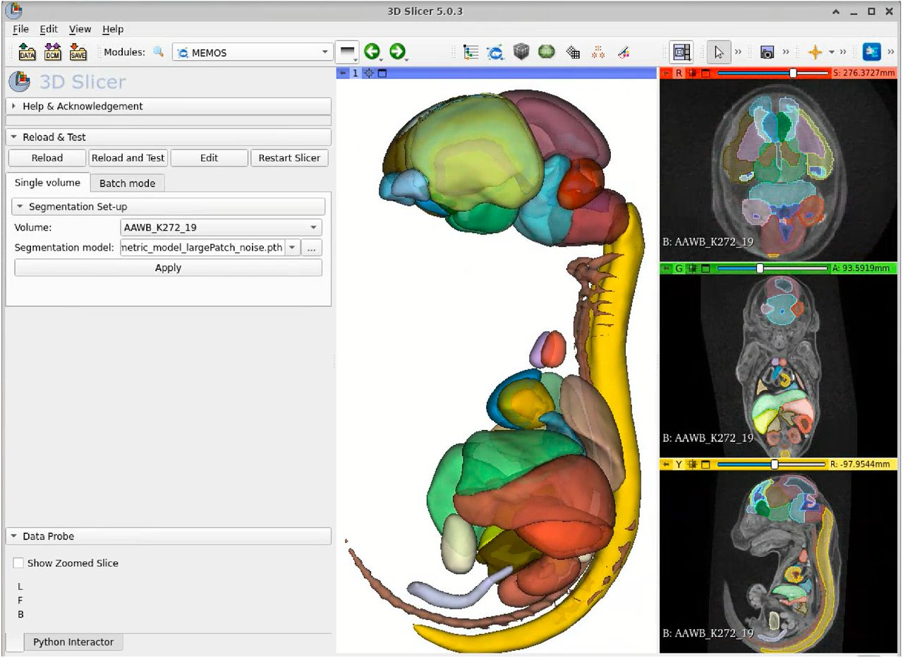

# MEMOS
**Mouse Embryo Multi-Organ Segmentations (MEMOS):** A 3D Slicer extension for automated segmentation of fetal mice. For details on the method please see the [accompanying preprint](https://www.biorxiv.org/content/10.1101/2022.08.26.505447v2.full). For step-by-step installation and use instructions, please refer to the [supplementary document](https://www.biorxiv.org/content/10.1101/2022.08.26.505447v2.supplementary-material).

Sample data for scan volumes of fetal mice at stage E15.5 can be downloaded from the [eg. CBX4 mutant From IMPC](https://www.mousephenotype.org/embryoviewer/?gene_symbol=CBX4)

